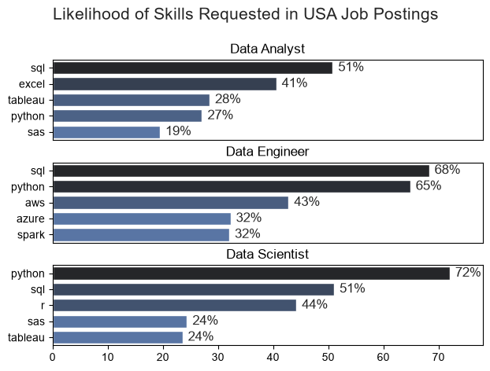
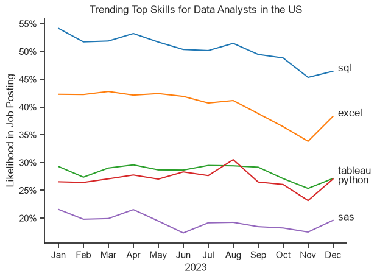
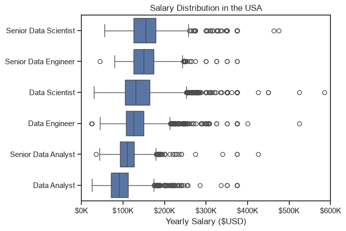
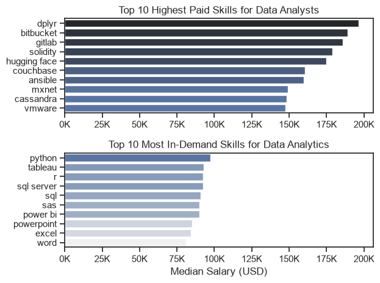
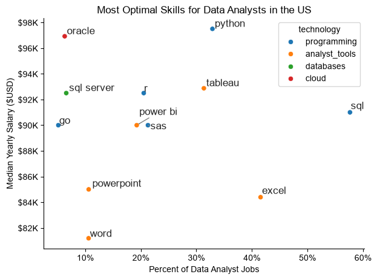

# Overview

Welcome to my analysis of the data job market, focusing on data analyst roles. This project was created out of a desire to navigate and understand the job market more effectively. It delves into the top-paying and in-demand skills to help find optimal job opportunities for data analysts.

The data sourced from Luke Barousse's Python Course which provides a foundation for my analysis, containing detailed information on job titles, salaries, locations, and essential skills. Through a series of Python scripts, I explore key questions such as the most demanded skills, salary trends, and the intersection of demand and salary in data analytics.

# The Questions

Below are the questions I want to answer in my project:

1. What are the skills most in demand for the top 3 most popular data roles?
2. How are in-demand skills trending for Data Analysts?
3. How well do jobs and skills pay for Data Analysts?
4. What are the optimal skills for data analysts to learn? (High Demand AND High Paying)

# Tools I Used

For my deep dive into the data analyst job market, I harnessed the power of several key tools:

- **Python:** The backbone of my analysis, allowing me to analyze the data and find critical insights. I also used the following Python libraries:
  - **Pandas Library:** This was used to analyze the data.
  - **Matplotlib Library:** I visualized the data.
  - **Seaborn Library:** Helped me create more advanced visuals.
- **Jupyter Notebooks:** The tool I used to run my Python scripts which let me easily include my notes and analysis.
- **Visual Studio Code:** My go-to for executing my Python scripts.
- **Git & GitHub:** Essential for version control and sharing my Python code and analysis, ensuring collaboration and project tracking.

# Data Preparation and Cleanup

This section outlines the steps taken to prepare the data for analysis, ensuring accuracy and usability.

## Import & Clean Up Data

I start by importing necessary libraries and loading the dataset, followed by initial data cleaning tasks to ensure data quality and readiness for analysis.

# The Analysis

Each Jupyter notebook for this project aims at investigating specific aspects of the data job market. Here's how I approached each question:

## 1. What are the most demanded skills for the top 3 most popular data roles?

To find the most demanded skills for the top 3 most popular data roles, I fiiltered out those positions by which ones were the most popular, and got the top 5 skills for these top 3 roles. This query highlights the most popular job titles and their top skills, showing which skills I should pay attention to depending on the role I'm targeting.

View my notebook with detailed steps here:
[2_Skill_Demand.ipynb](3_Project/2_Skill_Demand.ipynb)

### Visualize Data

```python
fig, ax = plt.subplots(len(job_titles), 1)

for (i, job_title) in enumerate(job_titles):
    df_plot = df_skills_perc[df_skills_perc['job_title_short'] == job_title].head()
    sns.barplot(data = df_plot, x = 'skills_percent', y = 'job_skills', ax = ax[i], hue = 'skill_count', palette = 'dark:b_r')

plt.show()
```

### Results



### Insights

- Python is a versatile skill, highly demanded across all three roles, but most prominently for Data Scientists (72%) and Data Engineers (65%).
- SQL is the most requested skill for Data Analysts and Data Scientists, with it in over half the job postings for both roles. For Data Engineers, Python is the most sought-after skill, appearing in 68% of job postings.
- Data Engineers require more specialized technical skills (AWS, Azure, Spark) compared to Data Analysts and Data Scientists who are expected to be proficient in more general data management and analysis tools (Excel, Tableau).

## 2. How are in-demand skills trending for Data Analysts?

To find how skills are trending in 2023 for Data Analysts, I filtered data analyst positions and grouped the skills by the month of the job postings. This got me the top 5 skills of data analysts by month, showing how popular skills were throughout 2023.

View my notebook with detailed steps here: [3_Skills_Trend](3_Project/3_Skills_Trend.ipynb).

### Visualize Data

```python

from matplotlib.ticker import PercentFormatter

df_plot = df_da_us_percent.iloc[:, :5]
sns.lineplot(data = df_plot, dashes = False, legend = 'full', palette = 'tab10')

plt.gca().yaxis.set_major_formatter(PercentFormatter(decimals = 0))

plt.show()

```

### Results


_Bar graph visualizing the trending top skills for data analysts in the US in 2023._

### Insights:

- SQL remains the most consistently demanded skill throughout the year, although it shows a gradual decrease in demand.
- Excel experienced a significant increase in demand starting around September, surpassing both Python and Tableau by the end of the year.
- Both Python and Tableau show relatively stable demand throughout the year with some fluctuations but remain essential skills for data analysts.
- SAS, while less demanded compared to the others, shows a slight upward trend towards the year's end.

## 3. How well do jobs and skills pay for Data Analysts?

To identify the highest-paying roles and skills, I only got jobs in the United States and looked at their median salary. But first I looked at the salary distributions of common data jobs like Data Scientist, Data Engineer, and Data Analyst, to get an idea of which jobs are paid the most.

View my notebook with detailed steps here: [4_Salary_Analysis](3_Project/4_Salary_Analysis.ipynb).

### Salary Analysis for Data Nerds

```python

sns.boxplot(data = df_us_top6, x = 'salary_year_avg', y = 'job_title_short', order = job_order)

ax = plt.gca()
ax.xaxis.set_major_formatter(plt.FuncFormatter(lambda x, pos: f'${int(x/1000)}K'))

plt.show()

```

### Results


_Box Plot visulaizing the salary distributions for the top 6 data job titles._

### Insights

- Role-Based Salary Progression: Median compensation scales predictably with seniority and technical complexity, advancing from a baseline median of around $90K for Data Analysts to approximately $150K for Senior Data Scientists. Across tracks, Data Engineering and Data Science roles command higher median brackets than traditional analyst paths.
- Variance and Dispersion: Technical roles such as Data Scientists and Data Engineers display wider interquartile ranges (IQRs) and broader overall distributions. This higher variance reflects greater compensation elasticity, driven by diverse skill sets, industry sectors, and specialization levels within these fields.
- Right-Skewed Outliers and High-End Earnings: Substantial right-skewed outliers appear across nearly all designations, with top-tier earners in Data Science and Data Engineering stretching toward the $500K to $600K threshold. This indicates a lucrative upper tail in the market, likely corresponding to principal engineers, specialized domain experts, or leadership roles.

## 3. How well do jobs and skills pay for Data Analysts?

### Highest Paid and Most Demanded Skills for Data Analysts

#### Visualize Data

```python

fig, ax = plt.subplots(2, 1)

# Top 10 Highest Paid Skills for Data Analysts
sns.barplot(data = df_da_top_pay, x = 'median', y = df_da_top_pay.index, ax = ax[0], hue = 'median', palette = 'dark:b_r', legend = False)

# Top 10 Most In-Demand Skills for Data Analysts
sns.barplot(data = df_da_skills, x = 'median', y = df_da_skills.index, ax = ax[1], hue = 'median', palette = 'light:b', legend = False)

plt.show()

```

#### Results

Here's the breakdown of the highest paid and the most in-demand skills for data analysts in the US:


_Two separate bar graphs visualizing the highest paid skills and in-demand skills for data analysts in the US._

#### Insights

- Discrepancy Between High Pay and High Demand: The highest-paying skills (such as `dplyr`, `bitbucket`, and `gitlab`, commanding median salaries between $150K and nearly $200K) do not overlap with the most in-demand daily core competencies (such as `python`, `tableau`, and `sql`). This highlights a market premium for specialized developer tooling and advanced data manipulation over standard reporting skills.
- Core Competency Baseline: The top in-demand skills anchor a steady, highly clustered salary tier ranging from roughly $80K to just under $100K. Traditional productivity and reporting staples like `word`, `excel`, and `powerpoint` form the lower end of this demand ranking, while python leads the volume chart approaching the $100K threshold.
- Niche Engineering and DevOps Premium: The upper panel demonstrates that Data Analysts who possess adjacent software engineering, version control, and infrastructure skills (`bitbucket`, `gitlab`, `solidity`, and `ansible`) unlock significantly higher compensation packages. This indicates that technical hybridity—blending analytics with engineering pipelines—acts as a major salary accelerator.

## 4. What is the most optimal skill to learn for Data Analysts

To maximize career potential, I combined demand and salary data to find the optimal skills for data analysts—targeting technologies that offer both high market prevalence and top-tier compensation.

View my notebook with detailed steps here: [5_Optimal_Skills](3_Project/5_Optimal_Skills.ipynb).

### Visualize Data

```python

import matplotlib.pyplot as plt
from adjustText import adjust_text

plt.scatter(df_da_skills_high_demand['skill_percent'], df_da_skills_high_demand['median_salary'])

plt.show()

```


_A scatter plot visualizing the most optimal skills (high paying & high demand) for data analysts in the US._

### Insights

- High-Demand Foundations: Core querying and spreadsheet tools such as `sql` and `excel` sit at the highest end of the adoption spectrum (appearing in roughly 42% to nearly 60% of listings), anchoring the baseline skill set for data analyst roles while offering moderate median salaries between $84K and $91K.
- The Sweet Spot for Compensation and Prevalence: Programming and visualization skills like `python` and `tableau` strike a powerful balance, commanding high market penetration (30% to 34% adoption) alongside top-tier median salaries ranging from $93K to over $97K.
- Niche Infrastructure Premiums: Specialized technologies like `oracle` and `sql server` represent lower-frequency requirements (under 10% market share), yet `oracle` delivers one of the highest median salaries on the chart at nearly $97K, highlighting a specialized compensation premium for niche database expertise.

## What I Learned

Throughout this project, I deepened my understanding of the data analyst job market and enhanced my technical skills in Python, especially in data manipulation and visualization. Here are a few specific things I learned:

- **Advanced Python Usage:** Utilizing libraries such as Pandas for data manipulation, Seaborn and Matplotlib for data visualization, and other libraries helped me perform complex data analysis tasks more efficiently.
- **Data Cleaning Importance:** I learned that thorough data cleaning and preparation are crucial before any analysis can be conducted, ensuring the accuracy of insights derived from the data.
- **Strategic Skill Analysis:** The project emphasized the importance of aligning one's skills with market demand. Understanding the relationship between skill demand, salary, and job availability allows for more strategic career planning in the tech industry.

## Insights

This project provided several general insights into the data job market for analysts:

- **Skill Demand and Salary Correlation:** There is a clear correlation between the demand for specific skills and the salaries these skills command. Advanced and specialized skills like Python and Oracle often lead to higher salaries.
- **Market Trends:** There are changing trends in skill demand, highlighting the dynamic nature of the data job market. Keeping up with these trends is essential for career growth in data analytics.
- **Economic Value of Skills:** Understanding which skills are both in-demand and well-compensated can guide data analysts in prioritizing learning to maximize their economic returns.

## Challenges I Faced

This project was not without its challenges, but it provided good learning opportunities:

- **Data Inconsistencies:** Handling missing or inconsistent data entries requires careful consideration and thorough cleaning techniques to ensure the integrity of the analysis.
- **Complex Data Visualization:** Designing effective visual representations of complex datasets was challenging yet rewarding for conveying insights clearly and compellingly.
- **Balancing Breadth and Depth:** Deciding how deeply to dive into each analysis while maintaining a broad overview of the job market landscape required constant balancing to ensure comprehensive coverage without getting lost in details.

## Conclusion

This exploration into the data analyst job market has been incredibly informative, highlighting the critical skills and trends that shape this evolving field. The insights I got enhance my understanding and provide actionable guidance for anyone looking to advance their career in data analytics. As the market continues to change, ongoing analysis will be essential to stay ahead in data analytics. This project is a good foundation for future explorations and underscores the importance of continuous learning and adaptation in the data field.
